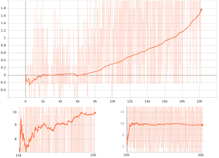

# Reinforced learning on マリオカート using Batched-IMPALA

This is an implementation of IMPALA (with batching for single GPU case) in PyTorch. It also incorporates the Gym Wrappers to test the framework on SuperMarioKart-Snes.

## Results 

I trained an AI with this framework for 12 hours on my personnal computer, that unfortunalely suffers from a poor configuration (1060 and 8gb RAM), so only 2 async agents could be runned at a time. However, this still produces pretty nice results.

The configuration for this traning can be found in _default.cfg_. In this situation, only the MarioCircuit was used, with the circuits divided between a "traning" dataset (1~3) and a "testing" (unseen) dataset. The results are displayed bellow. You can also see the maps of the circuits that I used.

Rewards obtained :   
   


Result on MarioCircuit.Act3 (**SEEN**)   
   

Result on MarioCircuit.Act4 (**UNSEEN**)   
   


## Presentation

The main features of this project are :
* **Asynchronous Actor-Critic**
  * As was proposed in *Reinforcement Learning through Asynchronous Advantage Actor-Critic on a GPU* ([arXiv:1611.06256](https://arxiv.org/abs/1611.06256)) ;
  * This method takes advantage of the GPU's parallelisation to improve the results of A3C. Namely, all the predictions and the loss computations are batched together to increase the throughput of the model. This could also be extended to the multi-GPU case.
* **IMPALA**
  * This framework was proposed in *IMPALA: Scalable Distributed Deep-RL with Importance Weighted Actor-Learner Architectures* ([arXiv:1802.01561](https://arxiv.org/abs/1802.01561)) ;
  * *V-Trace* (a novel actor-critic algorithm), was also introduced in this paper. When using asynchronous updates based on trajectories recorded by agents, it provides an off-policy correction that reduces the bias and the variance, while maintaining a high thoughput.
* **PyTorch and Tensorboard**
  * The implementation I proposed is based on the popular framework [PyTorch](https://pytorch.org/), develloped by Facebook. I used **Torchscripts** to improve the overall training speed, with significant improvements
  * A process is dedicated to visualisation thanks to tensorboard, and intergrates various metrics (duration, cumulated reward, loss, batches rates, etc...);
* And among the rest...
  * **Gym Wrappers** for the [retro](https://github.com/openai/retro) environnement of OpenAI ;
  * **Ram Locations** of the main variables when emulating Mario Kart (using [Bizhawk](https://github.com/TASVideos/BizHawk)) ;


## Running the code

### Installation

To run this project, you need to install **nvidia-docker**. Just follow the installation steps on the [official repository from nvidia](https://github.com/NVIDIA/nvidia-docker). You can also run the code directly on CPU, but I wouldn't recommand it, since it's coded with a GPU perspective.

### Building the docker image

The project can be runned into a Docker Container, which contains all the dependencies for the project.

```bash
# Docker build the image
docker build -t KartRL:latest . 

# Docker run the container
# You can also use volume to work on the code inside a container [-v [folder]:/App]
docker run -it --rm -p 6006:6006 KartRL:latest
```

### Running the code

```bash
# Running the code
python run.py

# Outputing the result (replace state and checkpoint if necessary)
python record.py -s MarioCircuit.Act3 -p checkpoint.pt

# Launch the tensorboard
tensorboard --bind_all --port 6006 --logdir=./logs/
```

**Enjoy!** If you have any nice results, don't hesitate to message me!

## Possible improvements

- [ ] Replay Memory
- [ ] Fix Callback process
- [ ] Automatic tunning
- [ ] Multi-GPU case
- [ ] Comparaison with other algos
- [ ] Tuning of the parameters


## References :

* Courses  
  * [Reinforcement learning by David Silver (UCL)](http://www0.cs.ucl.ac.uk/staff/d.silver/web/Teaching.html)
* Papers
  * Playing Atari with Deep Reinforcement Learning [arXiv:1312.5602](https://arxiv.org/abs/1312.5602)
  * Asynchronous Methods for Deep Reinforcement Learning [arXiv:1602.01783](https://arxiv.org/abs/1602.01783)
  * Reinforcement Learning through Asynchronous Advantage Actor-Critic on a GPU [arXiv:1611.06256](https://arxiv.org/abs/1611.06256)
  * IMPALA: Scalable Distributed Deep-RL with Importance Weighted Actor-Learner Architectures [arXiv:1802.01561](https://arxiv.org/abs/1802.01561)
  * Great source for RL papers by OpenAI: [Spinning-up OpenAI](https://spinningup.openai.com/en/latest/spinningup/keypapers.html)
* Others 
  * [Bizhawk](https://github.com/TASVideos/BizHawk) : SNES emulator with ram watch
  * [Maps](http://www.mariouniverse.com/maps-snes-smk/), [RAM map](https://datacrystal.romhacking.net/wiki/Super_Mario_Kart:RAM_map)